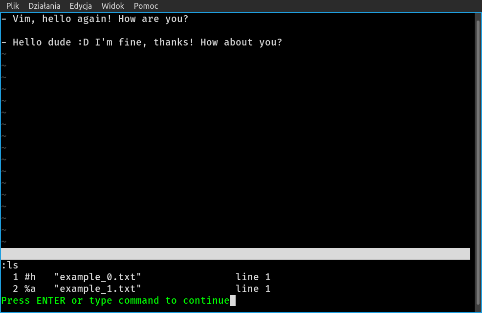

# `TL;DR`

In this short text there is presented minimal knowledge allowing for
usage of basic features of Vim/Neovim text editors.

Learning Vim with a flat learning curve -- could it be possible?

# VNLC

Start the terminal and:

0. in the terminal <i class="fa-solid fa-terminal"></i> `$ nvim <filename><enter>` -- to open a file.

1. in Vim <i class="fa-regular fa-keyboard"></i> `i` key -- to start actually typing;
   just after starting, Vim is in *normal mode*[^1]. `i` is one way of entering
   Vim's *insert mode*[^2].

2. `<esc>` key -- to stop adding new text;
after `<esc>` Vim turns to *normal mode*.

3. `:write <filename><enter>` -- to write the file.

4. `:quit<enter>` -- to exit Vim.

ATTENTION! Commands like `write`, or `quit` must be preceded by `:` and they
  do NOT work in *insert mode* -- they'd appear as regular text in the edited
file; in *normal mode*, after the `<esc>` key is pressed, `:` turns Vim
into *command-line mode*.

*In summary:*

  - 4 keys: `i`, `<esc>`, `:` and `<enter>`
  - keys for typing the text of document
  - 1 terminal command (`nvim` or `vim`) and 2 Vim commands[^3], `write` and `quit`

## Example 0

1. In terminal <i class="fa-solid fa-terminal"></i>

    `$ nvim example_0.txt<enter>  # file example_0.txt does not exist yet`

1. In nvim <i class="fa-regular fa-keyboard"></i>
    1. `i` -- switch to insert mode; continue typing the text:
```
        - Hello Vim!<enter>
        <enter>
        - Hello dude :)<esc>
```
    2. Last `<esc>` switches to normal mode; save the file and quit with commands:
```
        :write<enter>
        :quit<enter>
```
    
3. Result: typed contents were saved to file `example_0.txt` (in this case
there was no filename specified after `:write`, since Vim was started with
the name of the new file).

------------------------------------------------------------------------------

# VNLC+

All of the above +

1. Shortcuts:

  - `:w` for `:write`
  - `:q` for `:quit`
  - `:wq` for write and quit

    1.1. `:w` vs. `:w <filename>` -- write current file vs.
    write contents to the `<filename>`. In other words save vs. save as.

2. New commands:

  - `:edit <filename>` | `:e <filename>` -- to open (and edit) another file.
  - `:enew` for creating an empty, new file.
  - `C-[` i.e. `Ctrl + [` -- to exit the insert mode.

## Example 1

1. In terminal <i class="fa-solid fa-terminal"></i> (in the same directory where Example 0 was done):

    `$ nvim<enter>`

1. In nvim <i class="fa-regular fa-keyboard"></i>
    0. `:edit example_0.txt<enter>` -- opens file `example_0.txt`
       (shortcut: `:e`)
    1. `:enew<enter>` -- to start with an empty, new file.
       In this example Vim is started opening the previous file -
        to illustrate the `:enew` command.
    1. `i` -- to start typing, that is to say to switch to *insert mode*; right after
    starting Vim, if no files are passed as arguments, it is possible
    to simply press `i` and start typing contents of a new file, without points
    `0` and `1`. Type the text:
```
        - Vim, hello again! How are you?<enter>
        <enter>
        - Hello dude :D I'm fine, thanks! How about you?<C-[>
```
    3. `:w example_1.txt<enter>` to write the new file with the name provided;
    after `C-[` | `<esc>`, i.e. in normal mode.
    4. `:q<enter>` to quit Vim.

------------------------------------------------------------------------------

*Grand total of arcane Vim knowledge presented in this text:*

  - 4 keys: `i`, `<esc>`, `:`, `<enter>` and 1 combo `C-[`
  - 1 terminal command (`nvim` or `vim`) and 4 Vim commands, `write`, `quit`,
    `edit` and `enew`

Additional tips:

  - Files in Vim exist in buffers (or so they are called). To list all opened
buffers: `:ls<enter>`
  - To manage the buffers:
    - `:bn<enter>` for the next buffer.
    - `:bp<enter>` for the previous one.
    - `:b<number><enter>` for switching to buffer of number from `:ls`.
    - `:bd<enter>` for closing the current buffer.

    { .image-size }

  - Splitting the window:
    - `:split<enter>` | `:sp<enter>` for horizontal split.
    - `:vsplit<enter>` | `:vs<enter>` for vertical split.
    - `C-w w` to cycle through all the splits (`C-w h | j | k | l` won't be
mentioned here).
    - `:only<enter>` for closing all other splits, but the current one,
e\.g.
    ```vim
$ nvim<enter>
:e example_0.txt<enter>
:vs<enter>
C-w w
:e example_1.txt<enter>
    ```
    and both example files are opend in two splits.

    { .image-size }

------------------------------------------------------------------------------

# P. S.

1. The purpose of this text was *to unearth the truth about grand menace
behind learning how to use Vim*. This short article wasn't even supposed to
be an introduction to *vimtutor*. The intention was to show, that only
with just a few "vim actions" (pressing `i`, or `<esc>`, `:`),
few commands (like `e`, `w`, `q`, `enew`) it is *possible* to actually *use*
Vim, open, read end edit existing files and create and save new ones.
One could say it is nothing at all. The idea behind this little piece of text
is to make a difference between absolute nothing and something;
just to get you started with the *vimtutor*
(type this command in the terminal, work with it for some minutes
and your life may change...),

2. Commands `vim` and `nvim` were used interchangeably. You can choose either,
although Neovim seems to be better.

3. Actions indicated with `<enter>`, `<esc>`, `i` and `:` meant hitting the
appropriate key. *Vim commands*, as described earlier, meant hitting `:`,
typing the actual command, like `write` | `w`, and confirming it with `<enter>`.

4. There must be something going on about Vim, since even creators of entirely
different applications make use of the Vim modes (e.g. Obsidian, or
a plugin for Sublime Text). Just stick with *vimtutor* for several minutes,
learn about `j`, `k`, `l`, `m`, perhaps about `w`, `e`, `b` and `y`, `p`
and writing any text becomes like poetry...

5. Author of this text found configuration of Vim/Neovim troublesome (on
author's linux, the configuration files are `~/.vimrc`, for Vim, and
`~/.config/nvim/init.vim`, for Neovim). On one hand possibilities of fine
crafting the configuration are seemingly endless and may easily provide
new functionality in the editor, but on the other, setting configuration in
a text file requires at least some knowledge of the program.
With internet search
engine and AI assistance, along with some tenacity, it is possible
to craft even an IDE out of Vim, or to turn it into a LaTeX processor
(searching for a suitable plugin, testing it and fine-tuning its settings
requires time and effort, though).

------------------------------------------------------------------------------

# Further reading


1. [Vim documentation](https://vimhelp.org/index.html)
1. [Neovim documentation](https://neovim.io/doc/user/index.html)
1. [VIMTUTOR](https://vimschool.netlify.app/introduction/vimtutor/)
1. [Vim cheatsheet](https://vim.rtorr.com/)

[^1]: Normal mode is the mode in which Vim is started. To turn to normal mode, press `<esc>`.&nbsp;
[^2]: Other basic Vim modes, but *normal*: *insert*, *command-line*, *visual*.&nbsp;
[^3]: A Vim command is of the form `:command<enter>` -- pressing `:` puts Vim
    in the *command-line mode*, after which follows the actual command,
    confirmed with `<enter>`.&nbsp;

<!--
VFLC
====

0-advanced features with appropriate functionality.
───────────────────────────────────────────────────

0. terminal command:
    `nvim`

0.1. when with filename -- straight to editing the file.

1. `i` -- start typing
1.1. `esc` -- stop typing

2. `write <filename>` -- to write the file.

3. `edit` -- to open (and edit) another file.
3.1 `nenew` -- to start with an empty file.
(After 3, 3.1 -> 2.)

4. `quit` --to exit nvim.


VFLC
====

V im
F lat
L earning
C urve

or

VNLC
====

V im
N o
L earning
C urve
-->
